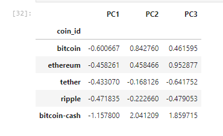

# Crypto_Clustering

This repository is to utilize the K-means algorithm to cluster the data using original dataframe and by using PCA dataframe (principal component analysis-data dimension reduction). The purpose is to demonstrate forming a data clustering and to provide comparison between clustering with and without using PCA.

Clustering: This automatically splits a dataset into groups according to a similarity.

Dimensionality reduction: This compresses very large datasets and keeps only the most useful information.

-----

## Technologies

Language: Python 3.9.12

Libraries used:

```python
 Pandas
 Jupyter Labs
 Pathlib
 PyViz hvPlot
 SKLearn
 ```

-----

## Installation Guide

```python
    conda install pandas
    conda install jupyterlab
    conda install -c pyviz hvplot
    pip install -U scikit-learn

Check the to make sure everything has been installed properly

    conda list pandas
    conda list hvplot
    conda list jupyter lab
    conda list scikit-learn
```

## Usage

To run this analysis jupyter lab notebook has been used. To run jupyter lab you need to use GitBash and navigate to where you have exported the files associated with this project and activate your dev environment. Next, this project can be ran by navigating to the crypto_investments.ipynb jupyter notebook file.

----

## Steps Taken

## Preparing the data

The first step is to prepare the data for KMeans algorithm to work. Following steps were taken to achieve that:

1. Used the StandardScaler module from scikit-learn to normalize the CSV file data.
2. Created a DataFrame that contains the scaled data. Be sure to set the coin_id 
    index from the original DataFrame as the index for the new DataFrame.


## Finding the best value of k

To utilise KMeans algorthim we need the value of k. k repesents number of optimum clusters for the data. For this project elbow method is used to get the best value of k.

## Optimize Clusters with Principal Component Analysis-PCA

PCA reduces the number of dimensions by transforming a large set of features into a smaller one that contains most of the information in the original, large set. This technique increases interpretability and minimizes information loss. In this project it will be reducing the number of features of the data from 7 to 3.



## KMeans clusting using original data and PCA data


With KMeans clustering original data, we can only view two features at a time. In our scatter plot, we are viewing price change percentage for 24hours and 7days which shows distinct four clusters. The two of the four clusters seem to be more spread out where as ethlend currency and celsius degree token are only coins in their respected clusters. However, PCA model which represent 90% of total data, shows more tighter clusters and more distinct grouping.

## Contributors

Brought to you by Amrita Prithiani

## License
MIT